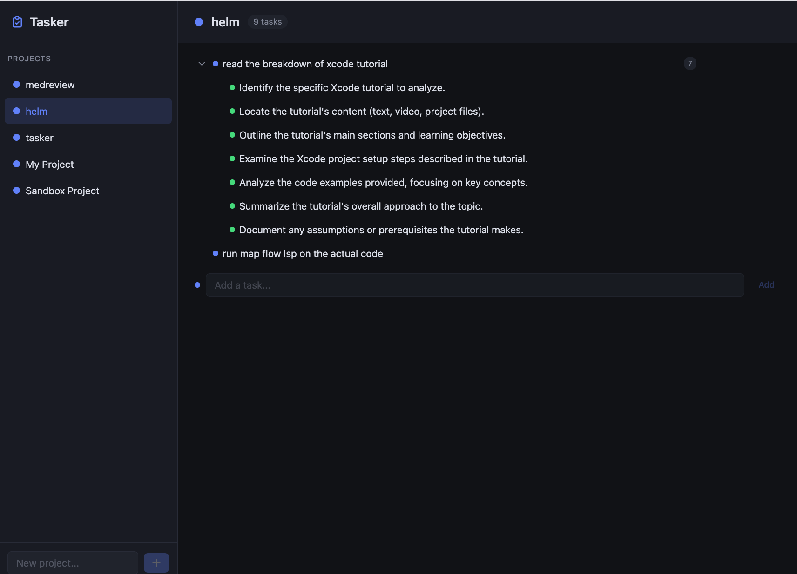
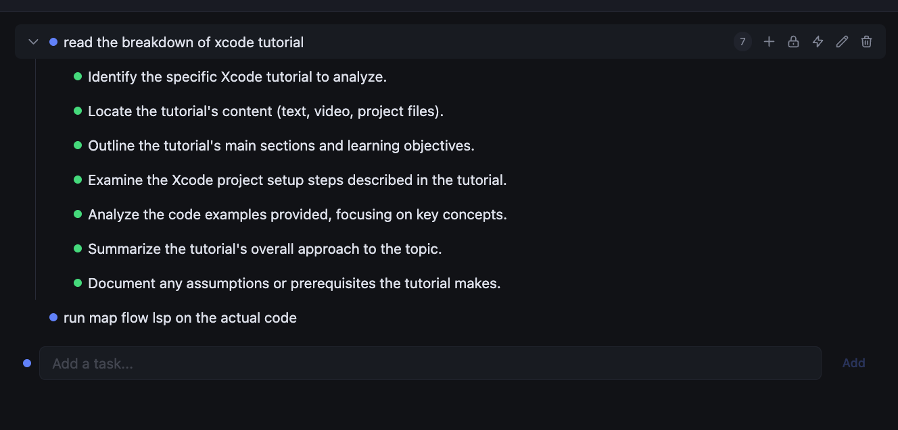

# Tasker

An AI-powered task management app with infinite-depth task trees. Create projects, add tasks, and use Google Gemini AI to automatically break tasks into actionable subtasks. Tasks can have blockers to track dependencies.



## Features

- **Project Management** — Create, rename, and delete projects with color coding
- **Infinite Task Trees** — Break tasks into subtasks with unlimited nesting depth
- **AI Task Breakdown** — Click "Break down" on any task and Gemini AI generates 3-7 actionable subtasks
- **Task Blockers** — Mark tasks as blocked by other tasks, with visual indicators and a management panel
- **Inline Editing** — Double-click any task or project name to edit in place
- **Dark Theme** — Clean, dark UI with depth-coded color indicators



## Tech Stack

| Layer | Technology |
|-------|-----------|
| Frontend | Alpine.js + Tailwind CSS (CDN, no build step) |
| Backend | Node.js + Express |
| Database | PostgreSQL |
| AI | Google Gemini API |

## Prerequisites

- [Node.js](https://nodejs.org/) (v18+)
- [PostgreSQL](https://www.postgresql.org/) (v14+)
- [Google Gemini API key](https://aistudio.google.com/apikey)

## Installation

1. **Clone the repo**

   ```bash
   git clone <repo-url>
   cd tasker
   ```

2. **Install dependencies**

   ```bash
   npm install
   ```

3. **Set up environment**

   ```bash
   cp .env.example .env
   ```

   Edit `.env` with your values:

   ```env
   PORT=3000
   DATABASE_URL=postgresql://localhost:5432/tasker
   GEMINI_API_KEY=your_gemini_api_key_here
   ```

4. **Create the database and run migrations**

   ```bash
   createdb tasker
   node db/migrate.js
   ```

5. **Start the server**

   ```bash
   # Development (auto-reload)
   npm run dev

   # Production
   npm start
   ```

6. **Open the app**

   Navigate to [http://localhost:3000](http://localhost:3000)

## Usage

1. **Create a project** — Type a name in the sidebar and click +
2. **Add tasks** — Use the "Add a task..." input at the bottom of the task area
3. **Break down with AI** — Hover over a task and click the sparkle icon to generate subtasks
4. **Expand/collapse** — Click the chevron arrow to show or hide subtasks
5. **Edit inline** — Double-click a task label or click the pencil icon to rename
6. **Manage blockers** — Click the lock icon on a task to add or remove blockers
7. **Delete** — Click the trash icon (confirms before deleting)

## Project Structure

```
tasker/
├── server.js              # Express entry point (31 lines)
├── .env                   # Environment variables (not committed)
├── .env.example           # Environment template
├── package.json
├── db/
│   ├── pool.js            # PostgreSQL connection pool
│   ├── migrate.js         # Migration runner
│   ├── 001-projects.sql   # Projects table
│   ├── 002-tasks.sql      # Tasks table (self-referencing tree)
│   └── 003-task-blockers.sql  # Blocker relationships
├── routes/
│   ├── projects.js        # GET/POST/PUT/DELETE /api/projects
│   ├── tasks.js           # CRUD + recursive tree query
│   ├── blockers.js        # Blocker management
│   └── gemini.js          # AI breakdown proxy
├── public/
│   └── index.html         # Full frontend app (Alpine.js + Tailwind)
└── docs/
    ├── adrs/              # Architecture Decision Records
    ├── plans/             # Design docs and implementation plan
    └── screenshots/       # App screenshots
```

## API Endpoints

| Method | Endpoint | Description |
|--------|----------|-------------|
| GET | `/api/health` | Health check |
| GET | `/api/projects` | List all projects |
| POST | `/api/projects` | Create project |
| PUT | `/api/projects/:id` | Update project |
| DELETE | `/api/projects/:id` | Delete project (cascades) |
| GET | `/api/projects/:id/tasks` | Full task tree (nested JSON) |
| POST | `/api/tasks` | Create task |
| PUT | `/api/tasks/:id` | Update task |
| DELETE | `/api/tasks/:id` | Delete task (cascades to children) |
| GET | `/api/tasks/:id/blockers` | List blockers |
| POST | `/api/tasks/:id/blockers` | Add blocker |
| DELETE | `/api/tasks/:id/blockers/:bid` | Remove blocker |
| POST | `/api/gemini/breakdown` | AI task breakdown |

## Architecture Decisions

Design decisions are documented in `docs/adrs/`:

- **ADR-001** — Alpine.js + Tailwind CSS frontend
- **ADR-002** — Indented list as primary tree view
- **ADR-003** — Node.js Express backend
- **ADR-004** — PostgreSQL with adjacency list pattern
- **ADR-005** — Projects as parent entity
- **ADR-006** — Task blockers (many-to-many)

## License

MIT
